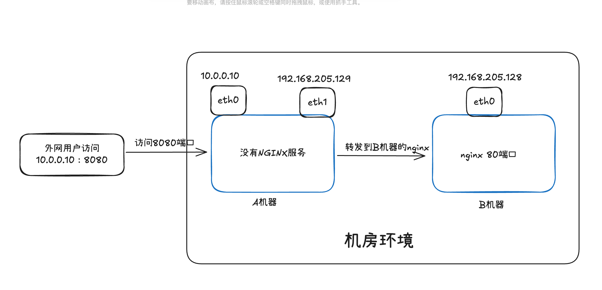
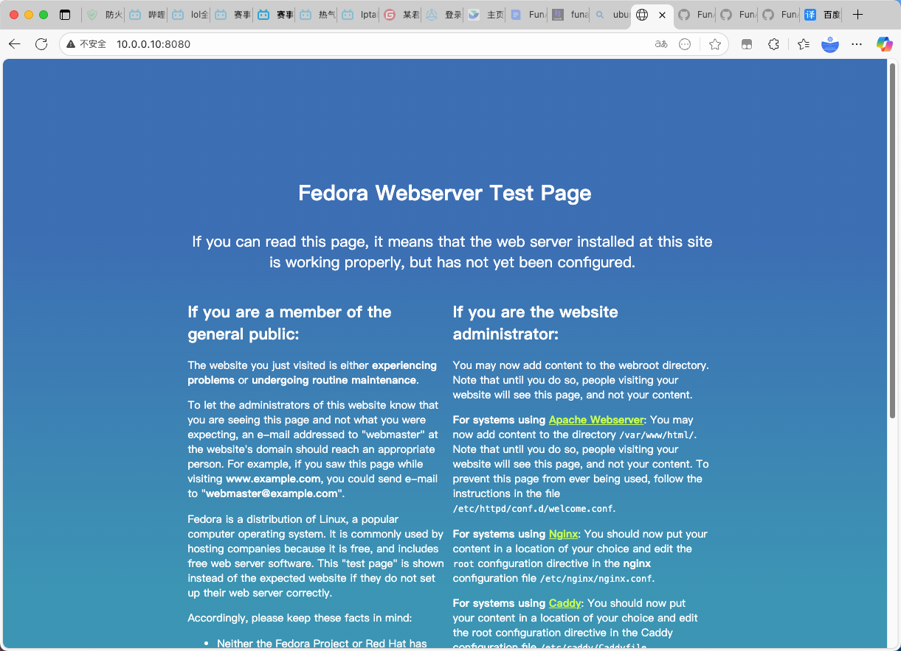

# 转发功能

## 端口转发

我有两台机器，a机器 两个网卡 一个外网网卡 10.0.0.10 一个内网网卡 192.168.205.129
b机器只有一个内网网卡 192.168.205.128。 我现在在b机器上安装了一个NGINX，现在我想要通过iptables的 prerouting DNAT的端口转发，实现 访问a机器的外网网卡的8080端口时 可以转发B机器的 80端口 应该怎么实现？



**全程在A机器上配置iptables规则**

```shell

# 开启IP转发
vim /etc/sysctl.conf
net.ipv4.ip_forward = 1
sysctl -p

# 添加 DNAT 规则（PREROUTING 链）
iptables -t nat -A PREROUTING \
  -d 10.0.0.10 \
  -p tcp --dport 8080 \
  -j DNAT \
  --to-destination 192.168.205.128:80

# 允许从外网到B机器80端口的新连接和已建立连接
iptables -A FORWARD \
  -d 192.168.205.128 \
  -p tcp --dport 80 \
  -m state --state NEW,ESTABLISHED \
  -j ACCEPT

# 允许B机器回复的已建立连接流量（反向）
iptables -A FORWARD \
  -s 192.168.205.128 \
  -p tcp --sport 80 \
  -m state --state ESTABLISHED \
  -j ACCEPT
  
# 添加 SNAT 规则
iptables -t nat -A POSTROUTING \
  -d 192.168.205.128 \
  -p tcp --dport 80 \
  -j SNAT \
  --to-source 192.168.205.129


iptables -L -n --line-numbers  # 查看 filter 表默认策略
iptables -t nat -L -n --line-numbers  # 查看 nat 表默认策略


# 验证
reqiqiu@reqiqiudebijibendiannao ~ % curl -I http://10.0.0.10:8080/
HTTP/1.1 200 OK
Server: nginx/1.28.0
Date: Tue, 28 Oct 2025 13:56:53 GMT
Content-Type: text/html
Content-Length: 8484
Last-Modified: Thu, 20 Mar 2025 00:00:00 GMT
Connection: keep-alive
ETag: "67db5a80-2124"
Accept-Ranges: bytes

reqiqiu@reqiqiudebijibendiannao ~ % 
```



## 转发限速


   

# 流量限速

```shell
出站、入站的流量限速： input限速、output限速

iptables -A INPUT -s 1.2.3.4 -p tcp --dport 53 -m limit --limit 2mbyte/s -m comment --comment "限速100mbit/s"  -j ACCEPT

iptables -A OUTPUT -s 1.2.3.4 -p tcp --dport 53 -m limit --limit --limit 500kbit/s -m comment --comment "限速100mbit/s"  -j ACCEPT

iptables -A INPUT -p icmp --icmp-type echo-request   -m limit --limit 10/s  -m comment --comment "限制ICMP ping请求速率，每秒最多10个"  -j ACCEPT

iptables -A OUTPUT -p icmp --icmp-type echo-request   -m limit --limit 10/s  -m comment --comment "限制ICMP ping请求速率，每秒最多10个"  -j ACCEPT


# 2. 添加 hashlimit 规则：限制 srcip
iptables -A INPUT -s 1921.68.0.0/16 -p icmp --icmp-type echo-request -m hashlimit --hashlimit-mode srcip --hashlimit-upto 10/sec --hashlimit-burst 5 --hashlimit-name ping_limit -j ACCEPT

# 192.168.0.0/16 网段内，每个 /24 子网（如 192.168.1.0/24、192.168.2.0/24）每分钟最多发送 1000 个 TCP 包，适合局域网流量管控
iptables -A INPUT -s 192.168.0.100 -p tcp -m hashlimit --hashlimit-mode srcip --hashlimit-upto 1000/min --hashlimit-burst 50 --hashlimit-name subnet_tcp_limit -j ACCEPT

# 所有IP地址限制1000个TCP包
iptables -A INPUT  -p tcp -m hashlimit --hashlimit-mode srcip --hashlimit-upto 1000/min --hashlimit-burst 50 --hashlimit-name subnet_tcp_limit -j ACCEPT


# 基于协议类型限制速率
iptables -A INPUT -p tcp \
-m hashlimit \
--hashlimit-mode srcip \
--hashlimit-upto 1mb/s \
--hashlimit-burst 1mb \
--hashlimit-name bandwidth_limit \
-j ACCEPT

# 基于单个端口限制速率
iptables -A INPUT -p tcp --dport 3389 \
-m hashlimit \
--hashlimit-mode srcip \
--hashlimit-upto 200kb/s \
--hashlimit-burst 500kb \
--hashlimit-name remote_port_limit \
-j ACCEPT

# 基于多个端口限制速率
iptables -A INPUT -p tcp -m multiport --dports 22,3389 \
-m hashlimit \
--hashlimit-mode srcip \
--hashlimit-upto 200kb/s \
--hashlimit-name remote_port_limit \
-j ACCEPT

# 基于单个IP地址限制速率
iptables -A INPUT -p tcp -s 192.168.1.100 \
-m hashlimit \
--hashlimit-mode srcip \
--hashlimit-upto 1kb/s \
--hashlimit-name single_ip_limit \
-j ACCEPT

# 基于单个网段限制速率
iptables -A INPUT -p tcp -s 192.168.0.0/24 \
-m hashlimit \
--hashlimit-mode srcip \
--hashlimit-upto 1mb/s \
--hashlimit-burst 1mb \
--hashlimit-name single_subnet_limit \
-j ACCEPT


# 最终综合案例

# 低于10kb每秒的允许通过
iptables -A INPUT  -p tcp \
-s 10.0.0.1 \
--dport 22 \
-m hashlimit \
--hashlimit-mode srcip,dstport \
--hashlimit-upto 10kb/s \
--hashlimit-name test \
-m comment --comment "低于10kb/s 通过" \
-j ACCEPT

# 高于10kb每秒的丢弃
iptables -A INPUT  -p tcp \
-s 10.0.0.1 \
--dport 22 \
-m hashlimit \
--hashlimit-mode srcip,dstport \
--hashlimit-above 10kb/s \
--hashlimit-name test \
-m comment --comment "高于10kb/s 丢弃" \
-j DROP

# 可以扩展的地方：
1、协议
2、源IP地址/源网段
3、方式 INPUT/OUPUT
4、目的端口 22
```


# 只允许国内IP地址访问的防火墙规则

```shell
# 只允许国内IP地址访问的防火墙规则
apt install -y ipset

# 1. 下载 APNIC 最新IP分配文件（断点续传）
wget -c http://ftp.apnic.net/stats/apnic/delegated-apnic-latest

# 2. 过滤中国IPv4段，计算子网掩码，输出到 ip.txt
cat delegated-apnic-latest | awk -F '|' '/CN/ && /ipv4/ {
    prefix = 32 - log($5)/log(2)
    printf "%s/%d\n", $4, prefix
}' > /root/ip.txt

# 可选：去重（避免重复IP段导致导入报错）
sort -u /root/ip.txt -o /root/ip.txt

# 验证导入结果（可选）：查看集合内IP段数量
ipset list chinaIP | grep "Number of entries"

# 在每个IP段前添加 "add chinaIP "（注意空格），生成临时文件
sed -i 's/^/add chinaIP /' /root/ip.txt

# 从处理后的 ip.txt 导入所有IP段到 chinaIP 集合 -exist：跳过重复条目（避免报错）
ipset restore -exist < /root/ip.txt

# 查看集合内条目数量（应显示大量条目，而非0）
ipset list chinaIP | grep "Number of entries"

# 随机查看几条导入的IP段（确认格式正确）
ipset list chinaIP | head -n 10


-m hashlimit --hashlimit-mode srcip,dstport --hashlimit-upto {} --hashlimit-name {} 
```


